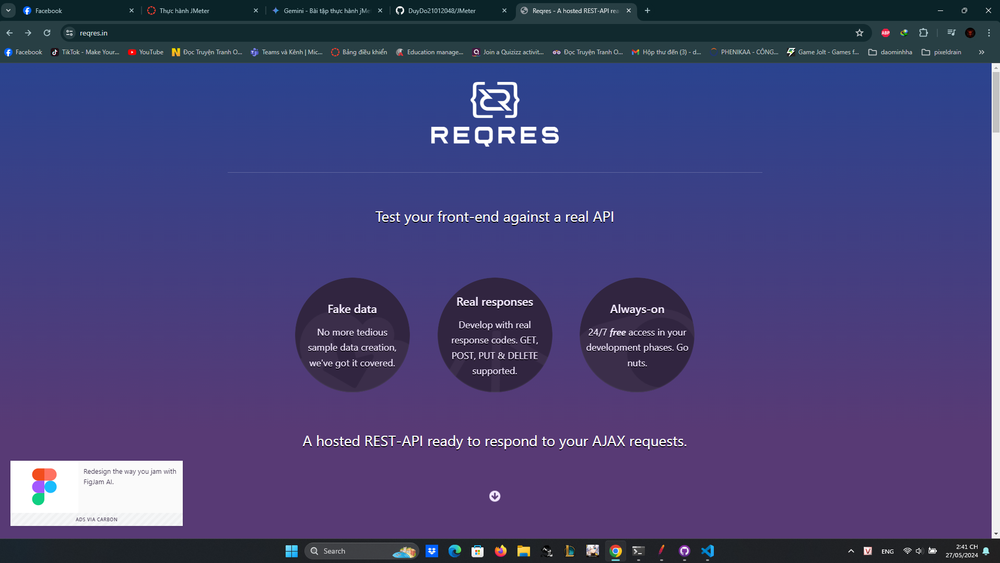
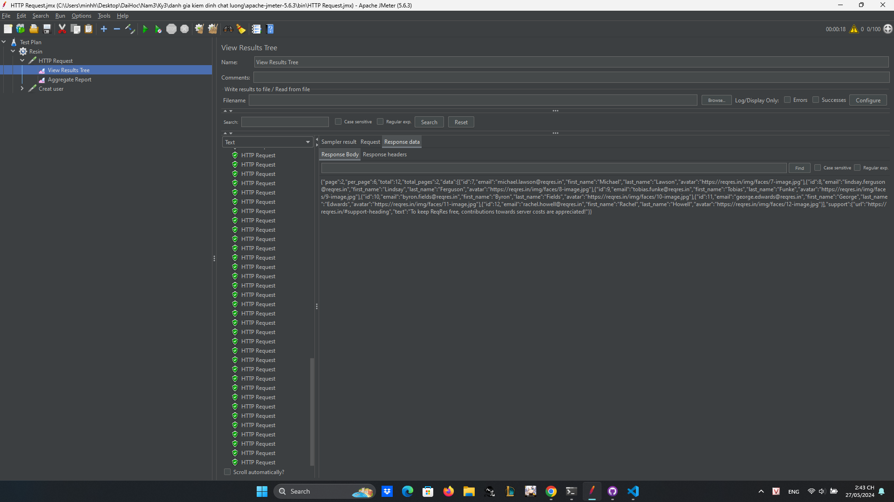
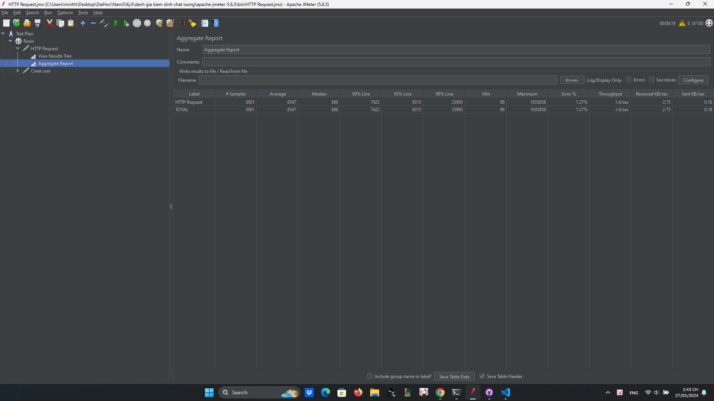

# JMeter

Trang web dùng để kiểm tra: https://reqres.in/

Kết quả với 100 user truy cập cùng một thời điểm:

Kết luận: với 100 user truy cập cùng một thời điểm trang web vẫn có thể chạy mượt mà, server không bị quá tải, tỉ lệ lỗi 1,27% 

Kết quả với 1000 user truy cập cùng một thời điểm:

