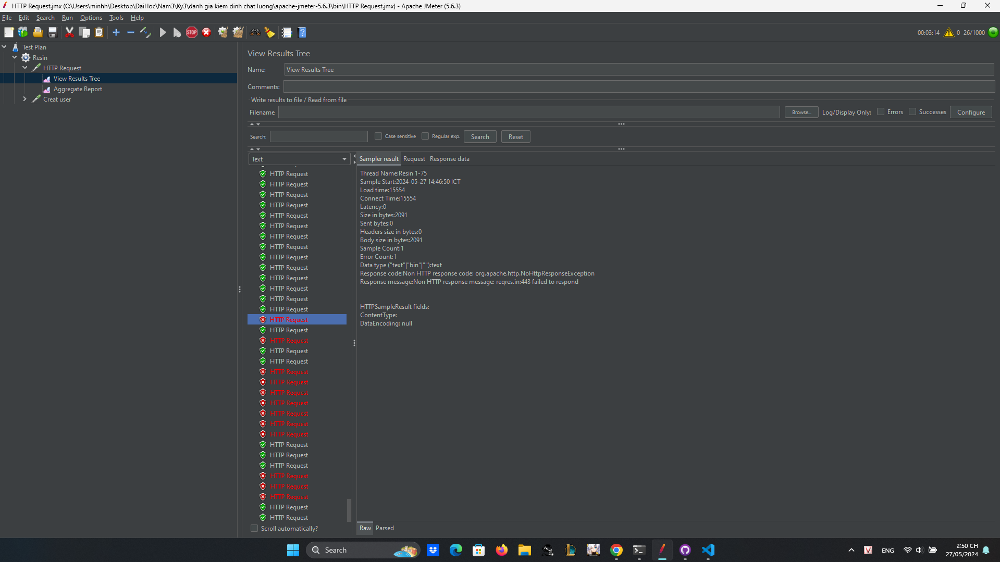
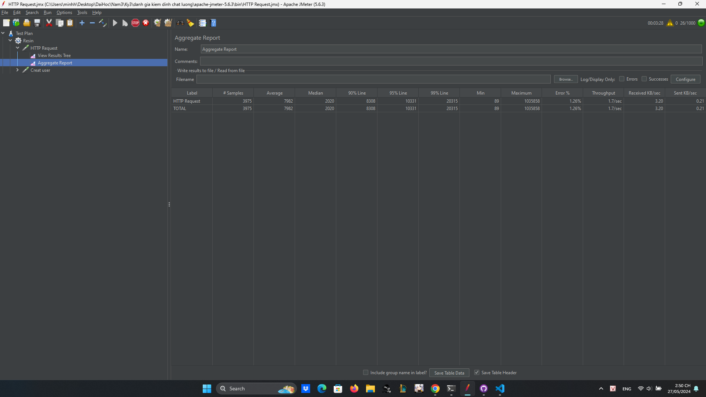

# JMeter

Trang web dùng để kiểm tra: https://reqres.in/

Kết quả với 100 user truy cập cùng một thời điểm:

Kết luận: với 100 user truy cập cùng một thời điểm trang web vẫn có thể chạy mượt mà, server không bị quá tải, tỉ lệ lỗi 1,27%, thời gian server phản hồi user là 18s

Kết quả với 1000 user truy cập cùng một thời điểm:

Kết luận: với 1000 user truy cập cùng một thời điểm trang web chạy mượt mà với khoảng 954 user đổ lại và không bị lỗi, từ user 955 bắt đầu xuất hiện lỗi và server không phản hồi 26 user truy cập sau cùng