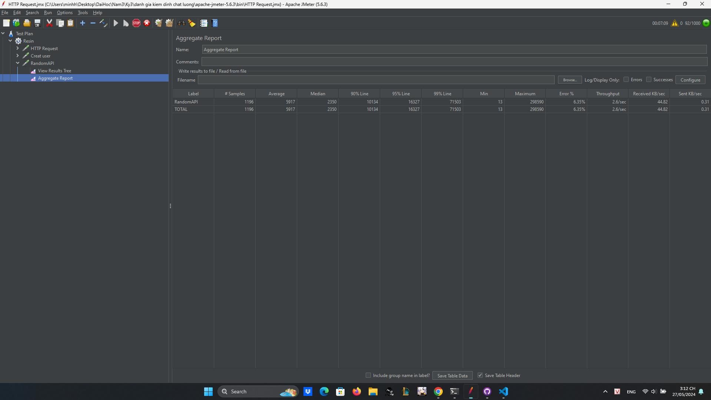

# JMeter

Trang web api dùng để kiểm tra: https://reqres.in/

Kết quả với 100 user truy cập cùng một thời điểm:

Kết luận: với 100 user truy cập cùng một thời điểm trang web vẫn có thể chạy mượt mà, server không bị quá tải, tỉ lệ lỗi 1,27%, thời gian server phản hồi  100 user là 18s

Kết quả với 1000 user truy cập cùng một thời điểm:

Kết luận: với 1000 user truy cập cùng một thời điểm trang web chạy mượt mà với khoảng 954 user đổ lại và không bị lỗi, từ user 955 bắt đầu xuất hiện lỗi và server không phản hồi 26 user truy cập sau cùng

Trang web api dùng để kiểm tra: https://random-data-api.com/documentation

Kết quả với 100 user truy cập cùng một thời điểm:

Kết luận: với 100 user truy cập cùng một thời điểm trang web vẫn có thể chạy mượt mà, tỉ lệ lỗi cao 26,39%, thời gian server phản hồi 100 user là 30s

Kết quả với 1000 user truy cập cùng một thời điểm:

Kết luận: với 1000 user truy cập cùng một thời điểm trang web chỉ phản hồi khoảng 900 user request và sau đó không phản hồi số lượng request còn lại, thời gian phản hồi trên 6 phút.

So Sánh :

Với 2 trang web https://reqres.in/ và https://random-data-api.com/documentation, https://reqres.in/ có hiệu năng tốt hơn khi có thể phản hồi số lượng request lớn hơn, tỉ lệ lỗi nhỏ hơn, thời gian phản hồi nhanh hơn  